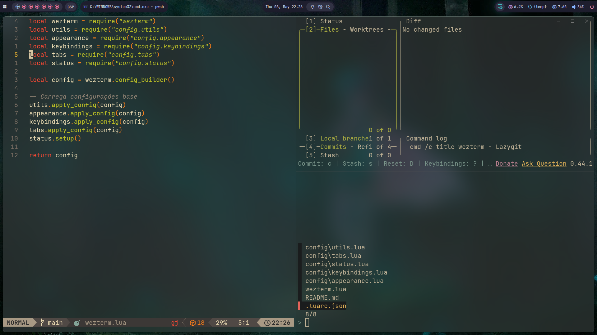

# 🌊 My WezTerm Configuration

This is my custom WezTerm setup focused on aesthetics, performance, and tmux-like workflows — all tailored for a smooth terminal experience on Windows.

## ✨ Features

- **Font**: JetBrains Mono, size 15
- **Colors**: Gruvbox Dark (Hard)
- **Effects**: Transparent background with acrylic blur
- **Performance**: 120 FPS for smooth animations
- **Tabs**:
  - Minimalist bottom tab bar
  - Custom tab titles with Nerd Font arrows
- **Key Bindings**:
  - `Ctrl + ç`: Tmux-style leader key
  - Create, close, switch, and move between panes and tabs
  - Custom bindings for up to 9 tabs

## 🛠️ Custom Touches

- Zero window padding for a cleaner look
- Smart tab title cropping
- Dynamic left status with leader key indicator 🌊
- Starts in `pwsh` (PowerShell 7) at a fixed directory

## 🧪 Preview

---

**Enjoy.**
